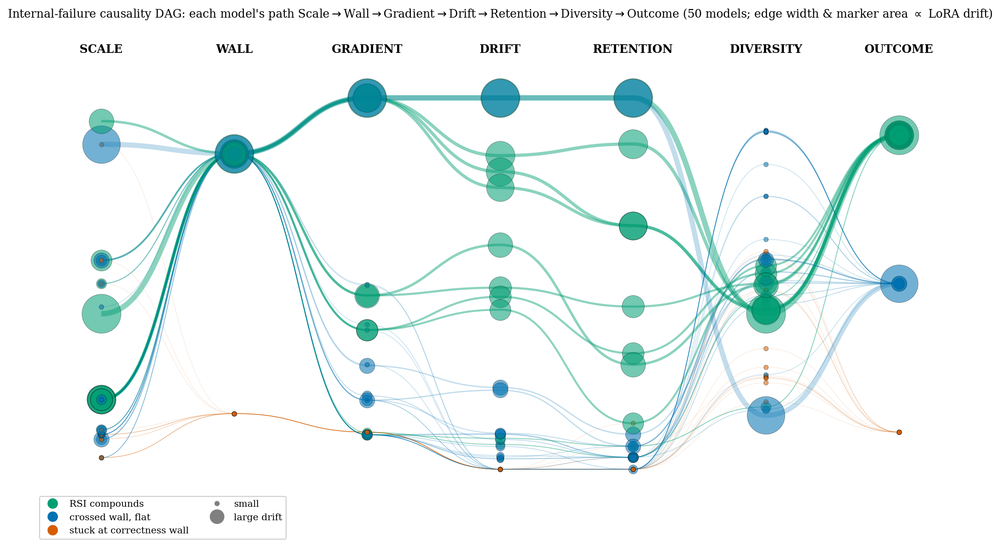
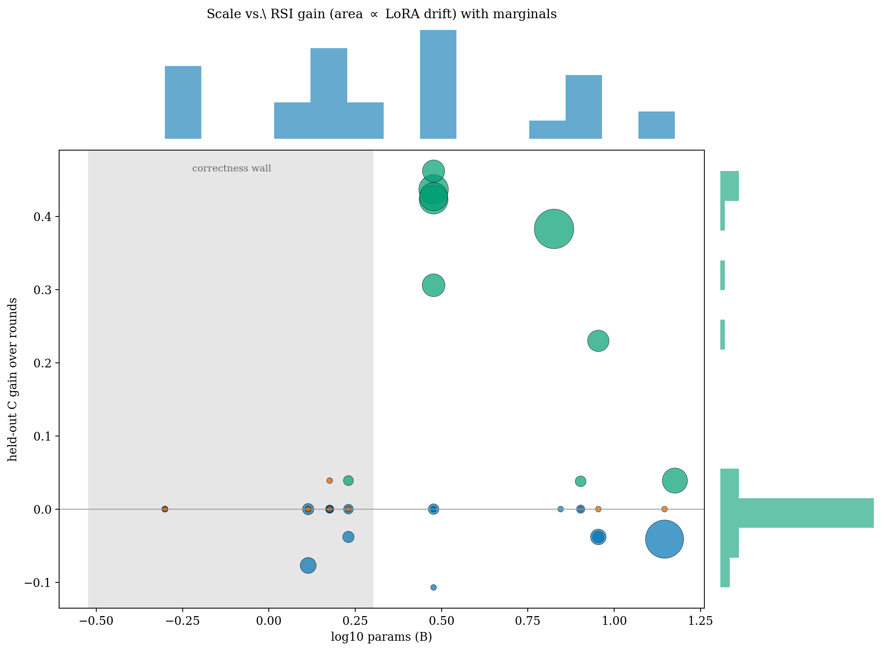

<p align="center"></p>

<h1 align="center">KernelAscent</h1>

<p align="center"><b>Does verified self-improvement compound? A roofline-grounded, compute-matched testbed for RSI in GPU-kernel optimization.</b></p>

<p align="center">
Site: https://ahmd-mohsin.github.io/KernelAscent/ · Full record and every number: <a href="BENCHMARK_LOG.md"><code>BENCHMARK_LOG.md</code></a>
</p>

---

KernelAscent asks whether models get better at writing GPU kernels — and, crucially, whether that improvement **compounds recursively**. A model writes a kernel. We grade it for correctness against an fp32 reference and for speed against a baseline (eager today; a unified `torch.compile` baseline is reported separately). Scores are headroom-normalized against a per-task roofline so the ceiling is the *model's* skill, never the benchmark's.

The benchmark is a ladder of five tasks. Tasks 1–4 are building blocks; **Task 5 (self-play) is the intended true-recursive-self-improvement metric** — though in the current runs the live authors did not yield enough valid tasks for it to be measurable (see [Findings](#5-task-5--self-play-undefined-at-the-current-author-yield)).

- **Task 1 — Capability.** Can a model write a correct, fast kernel in one shot. Open and closed models compete.
- **Task 2 — Weight-RSI.** An open-weight model LoRA-trains on its own correct kernels; does held-out capability keep rising? (weights are the improvement channel)
- **Task 3 — Procedure-RSI.** A model rewrites its own executable strategy library + verified archive; improvement without touching weights (works for closed models).
- **Task 4 — Closed→Open.** A closed frontier model rewrites the *training harness* of an open trainee; measures improvement transferred through tooling.
- **Task 5 — Self-play (true RSI).** The model authors its own strictly-harder tasks **and** solves+improves on them, so difficulty and capability co-evolve. This is the design intended to make recursive compounding falsifiable. Runs for both open-weight (weight channel) and closed (procedure channel) models. *Status: free-form task proposal collapses — the author yield is too low for `L−F` to be defined, so this rung is currently a negative result about task proposal, not a measurement of co-evolution.*

Capability is a snapshot of raw skill. Tasks 2–5 measure the *slope*, and Task 5 measures whether the slope feeds itself.

## Task 5 — self-play, the 3-arm design

Self-play conflates two effects: a harder curriculum, and an author that *co-evolves* with the solver. To separate them we run three arms from the same base at equal budget, scored each round on one fixed held-out ladder:

- **S — STATIC.** Fixed seed frontier; solver improves normally.
- **F — FROZEN-AUTHOR.** Frontier escalates, but the author is the frozen base — an adaptive curriculum from a non-evolving author. Solver still improves.
- **L — LIVE-AUTHOR.** Frontier escalates and the author is the *current, evolving* model. Only the author role differs from F.

The decomposition is the whole point: **L−S** = total curriculum benefit, **F−S** = benefit without updating the author, and **L−F = the benefit of author co-evolution** — the self-referential signal, and the primary metric. Every self-authored task passes an anti-reward-hacking gate (rejects constant-output, identity, no-op, or trivial-runtime tasks), is deduplicated, and its provenance is logged (model-proposed vs programmatic backstop). Sustained `L−F > 0` with `model_proposed > 0` is genuine recursive compounding; `L ≈ F` means "adaptive curriculum only."

**`L−F` is only defined when the author actually produces accepted tasks.** We require ≥5 accepted model-authored tasks before interpreting a row. In the current runs most authors fall below that floor, so `L ≈ F` must be read as *not measured*, not as *measured and equal*. Fixing this needs constrained, executable task mutation (a DSL over verified seed tasks) with validity and learnability gates applied identically to the F and L arms.

## Mechanism analysis — *why* RSI fails or *how* it passes

A rising curve says *whether* a model compounds; the mechanism probe says *why*. Each round we log generation diversity (distinct-2, pairwise dissimilarity — mode collapse), predictive entropy, LoRA weight-drift split by transformer depth (→0 means the ceiling is reached), retention on already-solved tasks (catastrophic forgetting), and the train−held transfer gap (memorization vs generalization). A verdict attributes each outcome to a mechanism: `diversity_collapse | forgetting | drift_saturation | no_transfer | no_headroom`, or PASS plus the depth that carries the learning. This turns a run that produces no gradient into a finding rather than a blank.

These are **associations, not established causal gates.** Two phrasings we have corrected: sub-2B models cross the correctness wall *less frequently* than ≥2B models (54% vs 92% of runs), not "never"; and among wall-crossers the discriminators of compounding are sustained drift and retention, while generation diversity is in fact *lower* in compounders (0.41 vs 0.52), so diversity collapse does not explain the null on this bank.

<p align="center"></p>

*Every model traces one path through the internal gates it must clear — **scale → correctness-wall → gradient → drift → retention → diversity → outcome**. Marker area and ribbon width scale with LoRA drift; color is the outcome (green = RSI compounds, blue = crossed the wall but flat, orange = stuck at the correctness wall). Sub-2B models bend down and orange at the wall; mid-scale models thread every gate and finish green; the largest drift most yet stall at the roofline.*

<p align="center"></p>

*Held-out capability gain vs model size, bubble area ∝ sustained LoRA drift, with marginal densities. The shaded band is the sub-2B correctness wall (gain pinned at zero); positive gain concentrates in the mid-scale 2–8B band; the largest models drift hardest but gain little (headroom saturation).*

An interactive, always-current version of both figures — plus a five-task agent-flow diagram — is on the [project site](https://ahmd-mohsin.github.io/KernelAscent/).

## Grading

A candidate kernel is a `class ModelNew` module. The grader runs in a crash isolated subprocess, so a kernel that triggers a CUDA device assert cannot poison the harness.

- **Correct** when its output matches the fp32 gold within tolerance (max(2e-2, 2×ref_err), on 3 fresh inputs).
- **Fast** by speedup over the baseline. A compiled baseline is being unified across tracks and reported as a separate column.
- **Score C** is **headroom-normalized**, per `docs/PREREGISTRATION.md`: `0` if incorrect, else
  `0.5 + 0.5·clamp((sp−1)/(ceiling−1), 0, 1)`, where `ceiling` is the *per-task roofline-achievable* speedup.
  Correct-at-parity = 0.5; correct-at-hardware-limit = 1.0 **whatever that limit is** — 1.1× or 40×. This
  replaced an earlier fixed-1.5× anchor, which capped compute-bound tasks below 1.0 and let memory-bound tasks
  saturate trivially. Numbers produced under the old anchor are not directly comparable.

Note on interpretation. Because 0.5 is parity and all correct kernels are admitted, a mid score can reflect learning to emit a reliably correct kernel rather than a faster one. We are separating correctness acquisition from speed optimization with a candidate audit and a compiled baseline. Treat the current board as a development result.

## Task 2, the RSI loop

Each round an open model writes kernels for a train split, gets LoRA trained on the ones that graded correct, and is re scored on a disjoint held out split. We report held out capability `C_r` each round, plus two controls.

- **Frozen base**, the same model with no training.
- **Round 0 data control**, retrained every round on the first round's kernels only.

RSI is supported when `C_r` rises and the self trained arm beats both controls. The round 0 control is the strict test. It separates genuine self improvement from simply doing more training.

**Difficulty standardization.** The RSI bank is filtered against the frozen base. We keep only tasks the base can sometimes solve but does not already run fast. This gives a low starting score with real room to climb, so a flat result reflects the model and not a saturated bank.

## Findings — does verified self-improvement compound?

**The headline is a bounded null flanked by one significant positive.** All numbers below are analysed at the
level of the **independent replicate — a trajectory** (one seed, one base checkpoint, one held split, one
accumulated adapter) — not the round. Rounds inside a run are serially dependent; an earlier version of this
README and the report pooled them as independent, which overstated the evidence. Regenerate everything here
with `python3 scripts/equivalence_tost.py --dir data/trajectories` and
`python3 scripts/search_vs_train.py --dir data/trajectories`, and check it with
`python3 scripts/consistency_audit.py`.

### 1. Persistent self-improvement: lineage ≈ matched reset (bounded null)

Carrying the self-trained lineage forward does **not** beat restarting from base at equal compute.

| scale | traj. n | rounds | lineage − reset (95% CI) | TOST δ=0.05 | BF₀₁ |
|---|--:|--:|---|---|--:|
| Qwen2.5-Coder-0.5B | 12 | 51 | −0.014 [−0.058, +0.030] | EQUIV | 2.6 |
| Qwen2.5-Coder-1.5B | 20 | 93 | −0.001 [−0.037, +0.035] | EQUIV | 4.5 |
| Qwen2.5-Coder-3B | 19 | 78 | −0.027 [−0.086, +0.032] | not equiv. | 2.7 |
| Qwen2.5-Coder-7B | 5 | 5 | +0.024 [−0.126, +0.174] | underpowered | 2.0 |
| **Pooled** | **57** | **228** | **−0.010 [−0.035, +0.016]** | **EQUIV** | **5.6** |

BF₀₁ = 5.6 is **moderate** evidence for the null, robust to dropping short runs (≥3 rounds: 5.9; ≥6 rounds:
4.9). The naive round-level pooling reports BF₀₁ = 14.7; that number is an artifact of treating correlated
rounds as independent and we do not claim it.

### 2. At matched compute, verified search beats self-training (significant)

| scale | traj. n | lineage − best-of-N (95% CI) |
|---|--:|---|
| 0.5B | 12 | −0.123 [−0.191, −0.056] |
| 1.5B | 20 | −0.114 [−0.157, −0.071] |
| 3B | 19 | −0.123 [−0.179, −0.067] |
| **Pooled** | **57** | **−0.111 [−0.138, −0.083]** |

Search beats lineage in **84% of runs**. This is the one result whose CI excludes zero, and unlike the null it
*strengthens* under the clustering correction. Practical corollary: where verification is cheap and dense and
cross-task transfer is low, spend compute on search, not on distilling that same budget into weights.

### 3. Mechanism: coverage is the currency, and it is not self-generated

Per-task p-maps on a fixed 29-task bank show the sub-2B "correctness wall" is a **low per-sample success
probability**, not absent capability:

| size | K | coverage | pass@1 | pass@K | K-ratio |
|---|--:|--:|--:|--:|--:|
| 0.5B | 64 | 13.8% | 0.009 | 0.109 | ~12× |
| 1.5B | 64 | 27.6% | 0.014 | 0.235 | ~17× |
| 3B | 64 | 82.8% | 0.112 | 0.777 | ~7× |
| 7B | 48 | 82.8% | 0.079 | 0.799 | ~10× |
| 14B | 24 | 86.2% | **0.655** | 0.862 | ~1× |

The *sharpenable* band (0 < p < 0.2 — the only mass rejection-sampling SFT can act on) is 14 / 28 / 59 / 79 /
0 % at 0.5 / 1.5 / 3 / 7 / 14B: thin below the wall, absent above it. Zero-score forensics show sub-3B failure
is kernel **formation** (`no_extract` 57–96% of candidates), not runnable-but-wrong code. Together:
self-training sharpens what a model already covers and cannot manufacture coverage — the mechanism behind the
null.

**WHY-RSI weight probes (n = 133 runs)** give an inverted-U in scale, reported as *associations*, not causal
gates: wall-crossing is 54% below 2B vs 92% at ≥2B (less frequent, **not** "never"); compounding peaks at
2–8B (50% of runs) and falls to 23% at ≥8B despite the largest LoRA drift — motion without progress near the
roofline. Among wall-crossers the discriminators are sustained **drift and retention**, not diversity:
compounders actually show *lower* generation diversity (0.41 vs 0.52), so "diversity collapse causes the
null" is **not** supported on this bank.

### 4. Task 3 — Procedure-RSI: gains are real; the "one-shot" reading is RETRACTED

Frontier models rewrite their own strategy library + verified archive. Restricted to runs with ≥3 completed
rounds, the gain appears **76% realised at round 0**, but that is not interpretable: the harness asks for "≤12" strategy strings and frontier models comply exactly — 5/5 interpretable runs sit at 11–12 from round 0 and 4/5 never grow. A procedure pinned at its limit in round 0 cannot be observed to keep improving, so "the model stopped" and "the harness stopped it" are not separable; the archive saturates by
round 1–2 while the self-written strategies stay diverse (Jaccard 0.12), so the bottleneck is converting
strategies into capability, not strategy homogeneity.

| model | rounds | Q-gain vs frozen | class |
|---|--:|--:|---|
| GPT-6-Astra | 6 | **+0.556** | improving (from low Q₀ — consuming headroom) |
| Claude-Sonnet-5 | 6 | +0.401 | plateau (cap-confounded) |
| Mistral-Large-3 | 6 | +0.310 | improving |
| Nova-Pro | 5 | +0.089 | improving |
| GPT-5.6-sol | 6 | +0.075 | plateau (cap-confounded) |
| GPT-5.6-terra | 6 | −0.001 | ceiling |

*Not interpreted (<3 completed rounds):* Kimi-K2.5 (2 rounds), Claude-Opus-5 (1), DeepSeek-V3.2 (1). The
apparent DeepSeek-V3.2 "self-degrade" of −0.234 is a single-round artifact, not a finding.

### 5. Task 5 — Self-play: undefined at the current author yield

`L−F` is only meaningful if the live author produced accepted, valid, novel tasks. Requiring ≥5 accepted
authored tasks, only 6/24 open runs and 5/11 closed runs qualify, and **10/11 closed rows are exactly 0.0** —
including authors that proposed 36–37 tasks over 24 rounds, which indicates the channel never engaged rather
than that it engaged and returned zero. The dedicated diagnosis run authored **zero** valid tasks in all 8
rounds, so every one of its per-round diagnostics is null.

Previously this README advertised StarCoder2-15B `L−F = +0.232` and two closed rows as "emerging positives".
Those are **withdrawn**: the StarCoder row rests on a single accepted authored task and the closed rows are
not in the current data. We report T5 as *undefined*, and the supported finding is narrower: **free-form task
proposal collapses** — without constrained, executable task mutation the author never manufactures a
frontier, so self-play cannot be tested at all.

### 6. Task 4 — Closed→Open: real but brittle

Peak improved-vs-frozen trainee with the harness rewritten by a closed researcher: Fable-5.1 → Qwen-1.5B
**+0.472**, → Qwen-7B +0.313. But the sign is pair-dependent — the same researcher *hurts* other trainees
(→ OpenCoder-1.5B −0.265, → DeepSeek-1.3B −0.444). Whether the gain is correctness rather than speed is open.

### 7. Probe-as-intervention: a modest secondary result, honestly bounded

A linear probe reads "is this kernel correct" out of mid-to-late layers at high pooled AUC (up to 0.985 on a
model whose actual correctness rate is 0.105) — the model *represents* correctness far better than it
*generates* it. Used to rerank K decoded candidates, and analysed at the **base-checkpoint** level (19 usable
runs are repeated draws over 12 distinct checkpoints), the probe beats uniform-random selection at matched
generation budget: **+0.124 [+0.029, +0.218]**, recovering 36% [11%, 60%] of the oracle−random headroom.

Three reasons this stays a secondary result:

1. **Uniform random is the weakest possible comparator.** Log-likelihood reranking, a compile/run validity
   filter and execution agreement were not run, so we cannot claim the probe is the best use of the compute.
2. **The denominators are tiny** — 5–12 test tasks per run, so a "+0.45" row is about five problems.
3. **Matched-generation selection ≠ matched-verification harvesting.** Reranking an existing pool more
   cheaply does not show that verification-constrained search gets cheaper.

**A gap we state rather than paper over:** per-candidate probe scores were never retained, so the *within-task*
ranking AUC — the only estimand that can explain a selection gain mechanistically — **cannot be recomputed**
from the released artifacts and is *unmeasured*, not measured-and-small. Runs with pooled AUC = 1.000 show
lifts anywhere from +0.000 to +0.250, which is exactly why pooled AUC cannot substitute for it. Regenerate
with `python3 scripts/probe_appendix.py`.

### What this null does and does not license

It is a **bounded** null: any compounding advantage is contained within ±0.05 at the tested scales, under
rejection-sampling SFT (not RL/GRPO), on the Qwen2.5-Coder family. It is **not** yet evidence that the harness
*could* have registered compounding — the positive control (lineage with coverage injected on tasks the model
never solves) has not been run, and it is the single most decisive outstanding experiment. We also distinguish
**persistent** self-improvement (inherited updates help later performance — what lineage-vs-reset tests) from
**recursive** self-improvement (updates improve the system's ability to produce its own future training signal
— what the recursion-interruption fork and self-play were built to test). The fork returns a one-time producer
upgrade; self-play never became measurable. We therefore make no recursive-self-improvement claim in either
direction.

## Datasets

Current design. The RSI bank ships publicly as a development split, and each run holds out a subset for scoring within that run. That held out subset is reconstructible from the public bank, so it is a development set, not a secret exam. A sealed evaluation set with structural and project level holdouts is being built to score the official board.

- **Capability kernel bank.** Tiered GPU kernel tasks. `dataset/kernel_bank/` and HF `muahmed7338/kernelascent-tasks`.
- **RSI hard bank.** Fable 5.1 curated, GPU validated, then difficulty filtered to the hard but learnable band. `dataset/kernel_bank/rsi_bank_hard.json`.

```python
from datasets import load_dataset
ds = load_dataset("muahmed7338/kernelascent-tasks")   # public split, by tier
```

## Evaluate a model

One command produces a submittable scorecard. Current results use a public development split. A sealed evaluation set is in progress.

```bash
docker build -t ka -f docker/Dockerfile .

# Task 1, Capability, open or closed
docker run --rm -e AWS_SHARED_CREDENTIALS_FILE=/creds -e AWS_PROFILE=bedrock \
  -v $PWD/creds:/creds:ro -v $PWD/out:/out ka \
  --track capability --api-model <model> --tier medium

# Task 2, RSI, open weight, GPU
docker run --rm --gpus all -v $PWD/out:/out ka \
  --track rsi --model <hf-id> --rounds 5 --k 3
```

Then open a [model submission issue](https://github.com/ahmd-mohsin/KernelAscent/issues/new?template=model-submission.yml) with your `scorecard.json`. Maintainers re run on the held out split and add your row. Automatic submission through GitHub is coming.

## Repo layout

| path | what |
|---|---|
| `kernelascent/v3/lab_weight_rsi.py` | Task 2 weight-RSI loop. Writes kernels, LoRA trains on correct ones, re scores held out |
| `kernelascent/v3/lab_track_c.py` | Task 3 procedure-RSI: model rewrites its own strategy library + verified archive |
| `kernelascent/v3/lab_selfplay_rsi.py` | Task 5a open self-play, 3-arm STATIC/FROZEN-AUTHOR/LIVE-AUTHOR, primary L−F |
| `kernelascent/v3/lab_selfplay_closed.py` | Task 5b closed (API) self-play, 3-arm, co-evolution via procedure |
| `kernelascent/v3/lab_rsi_mechanism.py` | why-RSI probe: diversity/entropy/drift-by-depth/retention/transfer + verdict |
| `kernelascent/v3/difficulty_filter.py` | difficulty standardization. Keeps only hard but learnable tasks against the frozen base |
| `kernelascent/v3/curate_kernel_tasks.py` | Fable 5.1 curator for the kernel banks, tiered L1 to L3, GPU validated |
| `kernelascent/v3/grade_batch.py` | crash isolated GPU grader, single and batch modes |
| `kernelascent/v3/lab_kernel.py` | kernel task loader and scoring |
| `kernelascent/agent_bench.py` | reference build, timing, and grading primitives |
| `kernelascent/evaluate.py` | single scoring entrypoint for both tracks |
| `dataset/kernel_bank/` | capability and RSI task banks |
| `docker/` | dockerized evaluation image |
| `docs/` | website, figures, and both leaderboards |
| `BENCHMARK_LOG.md` | full dated record and every number |

## Status

Working and reproducible. The capability leaderboard, the difficulty standardized RSI bank, the multi family RSI leaderboard, and the dockerized evaluator all run. The RSI board fills as runs complete.
