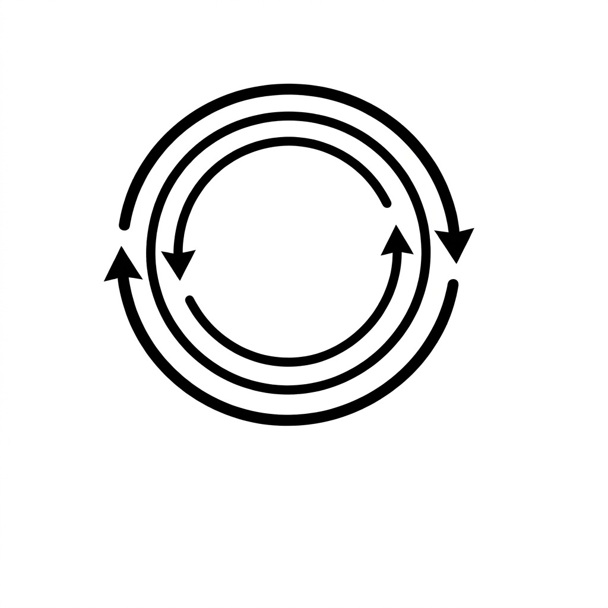

<p align="center"></p>

<h1 align="center">KernelAscent</h1>

<p align="center"><b>A benchmark for compounding kernel optimization.</b></p>

<p align="center">
Site: https://ahmd-mohsin.github.io/KernelAscent/ · Full record and every number: <a href="BENCHMARK_LOG.md"><code>BENCHMARK_LOG.md</code></a>
</p>

---

KernelAscent asks whether models get better at writing GPU kernels. A model writes a kernel. We grade it for correctness against an fp32 reference and for speed against `torch.compile`. The benchmark has two tasks.

- **Task 1, Capability.** Can a model write a correct, fast kernel in one shot. Open and closed models both compete.
- **Task 2, RSI.** Does self improvement compound. An open weight model trains on its own correct kernels and we check whether its held out capability keeps rising. Only open weight models can run this, because self improvement here means changing the model's own weights.

Capability is a snapshot of raw skill. RSI is the slope.

## Grading

A candidate kernel is a `class ModelNew` module. The grader runs in a crash isolated subprocess, so a kernel that triggers a CUDA device assert cannot poison the harness.

- **Correct** when its output matches the fp32 gold within tolerance.
- **Fast** by speedup over `min(eager, torch.compile)`.
- **Score C** is 0 when wrong, 0.5 at parity, and rises to 1.0 at a 1.5x speedup.

Two walls make the capability board discriminative. Correctness ranks the low and mid band. Beating `torch.compile` separates the frontier.

## Task 2, the RSI loop

Each round an open model writes kernels for a train split, gets LoRA trained on the ones that graded correct, and is re scored on a disjoint held out split. We report held out capability `C_r` each round, plus two controls.

- **Frozen base**, the same model with no training.
- **Round 0 data control**, retrained every round on the first round's kernels only.

RSI is supported when `C_r` rises and the self trained arm beats both controls. The round 0 control is the strict test. It separates genuine self improvement from simply doing more training.

**Difficulty standardization.** The RSI bank is filtered against the frozen base. We keep only tasks the base can sometimes solve but does not already run fast. This gives a low starting score with real room to climb, so a flat result reflects the model and not a saturated bank.

## Findings

- **Capability is a clean gradient.** Closed frontier models top both walls. Small open models sit at the correctness wall with low fast rate.
- **RSI is scale and family dependent.** On the standardized hard bank, small models start low and gain from self training. Several families keep pulling ahead of the fixed data control, which is genuine compounding. Very small models stay flat because they never produce a correct kernel to learn from. A strong 7B overfits, since it keeps solving the train tasks while its held out score falls.
- **The RSI score is a thermometer, not a cheerleader.** It reads near zero or negative when a model does not compound, and positive when it does.

The live leaderboard covers 19 open models across 9 families, including Qwen, DeepSeek, Yi, Phi, SmolLM, OpenCoder, StableCode, Llama, and Gemma.

## Datasets

Two split design. A public split is committed and on HuggingFace. A disjoint held out split scores the board and is never released.

- **Capability kernel bank.** Tiered GPU kernel tasks. `dataset/kernel_bank/` and HF `muahmed7338/kernelascent-tasks`.
- **RSI hard bank.** Fable 5.1 curated, GPU validated, then difficulty filtered to the hard but learnable band. `dataset/kernel_bank/rsi_bank_hard.json`.

```python
from datasets import load_dataset
ds = load_dataset("muahmed7338/kernelascent-tasks")   # public split, by tier
```

## Evaluate a model

One command produces a submittable scorecard. The board is scored on a private held out split.

```bash
docker build -t ka -f docker/Dockerfile .

# Task 1, Capability, open or closed
docker run --rm -e AWS_SHARED_CREDENTIALS_FILE=/creds -e AWS_PROFILE=bedrock \
  -v $PWD/creds:/creds:ro -v $PWD/out:/out ka \
  --track capability --api-model <model> --tier medium

# Task 2, RSI, open weight, GPU
docker run --rm --gpus all -v $PWD/out:/out ka \
  --track rsi --model <hf-id> --rounds 5 --k 3
```

Then open a [model submission issue](https://github.com/ahmd-mohsin/KernelAscent/issues/new?template=model-submission.yml) with your `scorecard.json`. Maintainers re run on the held out split and add your row. Automatic submission through GitHub is coming.

## Repo layout

| path | what |
|---|---|
| `kernelascent/v3/lab_weight_rsi.py` | the RSI loop. Writes kernels, LoRA trains on correct ones, re scores held out, batched generation and grading |
| `kernelascent/v3/difficulty_filter.py` | difficulty standardization. Keeps only hard but learnable tasks against the frozen base |
| `kernelascent/v3/curate_kernel_tasks.py` | Fable 5.1 curator for the kernel banks, tiered L1 to L3, GPU validated |
| `kernelascent/v3/grade_batch.py` | crash isolated GPU grader, single and batch modes |
| `kernelascent/v3/lab_kernel.py` | kernel task loader and scoring |
| `kernelascent/agent_bench.py` | reference build, timing, and grading primitives |
| `kernelascent/evaluate.py` | single scoring entrypoint for both tracks |
| `dataset/kernel_bank/` | capability and RSI task banks |
| `docker/` | dockerized evaluation image |
| `docs/` | website, figures, and both leaderboards |
| `BENCHMARK_LOG.md` | full dated record and every number |

## Status

Working and reproducible. The capability leaderboard, the difficulty standardized RSI bank, the multi family RSI leaderboard, and the dockerized evaluator all run. The RSI board fills as runs complete.
